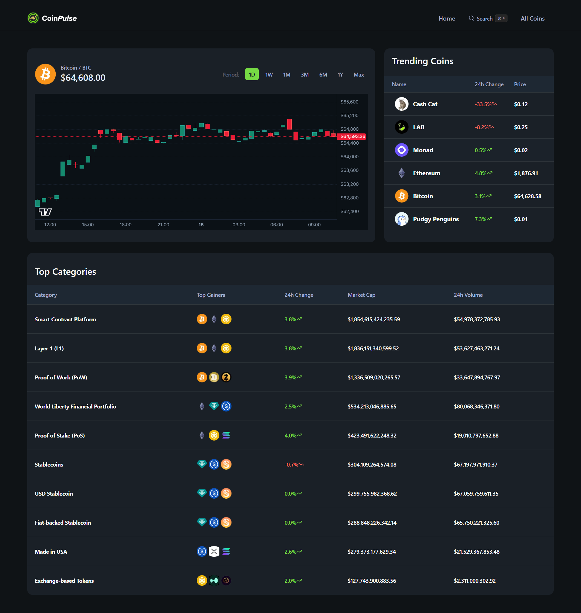
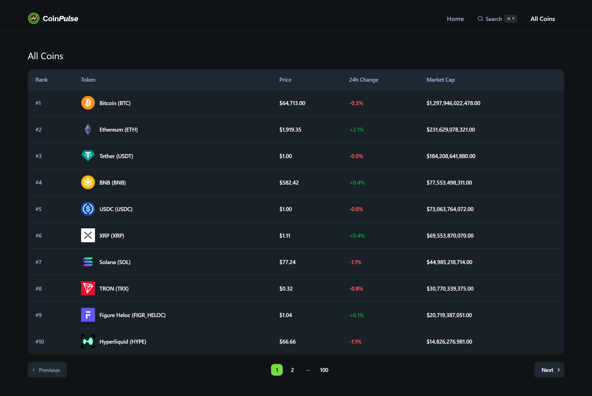
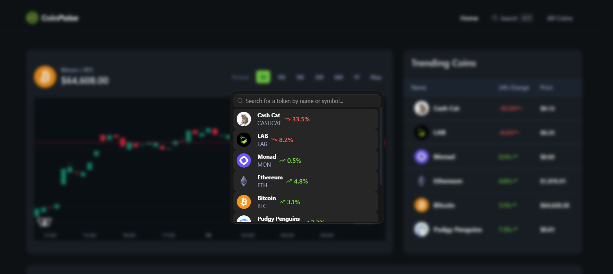
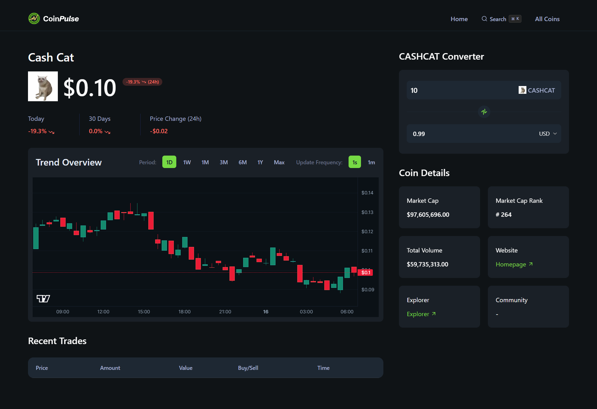

# 🚀 Crypto Trading Terminal

<p align="center">
  <strong>A modern real-time cryptocurrency market dashboard built with Next.js, React, TypeScript, and Lightweight Charts.</strong>
</p>

<p align="center">
  <a href="https://crypto-trading-terminal-two.vercel.app/"></a>
  <a href="https://github.com/IdushaGaravi/Crypto-Trading-Terminal"></a>
</p>

---

## 🌐 Live Demo

🔗 **Vercel Deployment:**  
https://crypto-trading-terminal-two.vercel.app/

📂 **GitHub Repository:**  
https://github.com/IdushaGaravi/Crypto-Trading-Terminal

---

## 📖 Overview

Crypto Trading Terminal is a professional cryptocurrency market analytics dashboard designed to provide traders and investors with an intuitive way to monitor market movements, explore trending coins, analyze price action, and track cryptocurrency categories.

The platform delivers a clean dark-themed trading experience inspired by modern financial terminals while maintaining excellent performance and responsiveness.

---

## ✨ Features

### 📊 Real-Time Market Dashboard
- Interactive candlestick charts
- Multiple time period selections
- Live market statistics
- Category-based market analysis

### 🔥 Trending Coins
- View trending cryptocurrencies
- Track 24-hour price movements
- Quick access to detailed coin pages

### 🔍 Advanced Search
- Search cryptocurrencies by:
  - Coin name
  - Symbol
  - Token identifier
- Fast command-style search experience

### 🪙 Detailed Coin Analytics
- Individual cryptocurrency pages
- Market cap information
- Trading volume statistics
- Market ranking
- External website & explorer links

### 💱 Cryptocurrency Converter
- Real-time token conversion
- Currency exchange calculations
- User-friendly conversion interface

### 📈 Market Categories
- Smart Contract Platforms
- Layer 1 Networks
- Proof of Work Projects
- Proof of Stake Projects
- Stablecoins
- Exchange Tokens
- And many more

### 📱 Responsive Design
- Desktop optimized
- Tablet friendly
- Mobile responsive
- Modern dark UI

---

# 🖼️ Screenshots

## Dashboard Overview



---

## All Coins Listing



---

## Search Functionality



---

## Coin Details Page



---

## 🏗️ System Architecture

```text
User
 │
 ▼
Next.js Application
 │
 ├── Dashboard
 ├── Coin Search
 ├── Coin Details
 ├── Converter
 └── Market Categories
 │
 ▼
External Cryptocurrency APIs
 │
 ▼
Real-Time Market Data
```

---

# 🛠️ Tech Stack

## Frontend

| Technology | Version |
|------------|----------|
| Next.js | 16.2.9 |
| React | 19.2.4 |
| React DOM | 19.2.4 |
| TypeScript | 5.x |
| Tailwind CSS | 4.x |
| Lightweight Charts | 5.2.0 |
| SWR | 2.4.2 |
| Lucide React | 1.23.0 |
| Radix UI | 1.6.0 |
| ShadCN UI | 4.12.0 |

---

## Additional Libraries

| Library | Version |
|----------|----------|
| class-variance-authority | 0.7.1 |
| clsx | 2.1.1 |
| cmdk | 1.1.1 |
| query-string | 9.4.1 |
| react-use | 17.6.1 |
| tailwind-merge | 3.6.0 |
| tw-animate-css | 1.4.0 |

---

## Development Tools

| Tool | Version |
|--------|----------|
| TypeScript | 5.x |
| ESLint | 9.x |
| PostCSS | Tailwind CSS 4 |

---

# 📂 Project Structure

```bash
crypto-trading-terminal/
│
├── app/
│   ├── page.tsx
│   ├── coins/
│   └── search/
│
├── components/
│   ├── charts/
│   ├── ui/
│   └── shared/
│
├── lib/
│
├── public/
│
├── types/
│
├── constants/
│
└── package.json
```

---

# ⚡ Getting Started

## Clone Repository

```bash
git clone https://github.com/IdushaGaravi/Crypto-Trading-Terminal.git

cd Crypto-Trading-Terminal
```

## Install Dependencies

```bash
npm install
```

## Run Development Server

```bash
npm run dev
```

Application will be available at:

```bash
http://localhost:3000
```

---

## Production Build

```bash
npm run build
npm start
```

---

# 🎯 Key Highlights

✅ Modern Trading Terminal UI

✅ Real-Time Cryptocurrency Tracking

✅ Interactive Candlestick Charts

✅ Advanced Search Experience

✅ Coin Converter

✅ Responsive Design

✅ Optimized Performance

✅ Built with Latest Next.js 16 & React 19

---

# 🚀 Deployment

The application is deployed on **Vercel**.

### Live Application

https://crypto-trading-terminal-two.vercel.app/

---

# 📈 Future Improvements

- WebSocket-based real-time updates
- Portfolio tracking
- Watchlists
- Trading indicators
- Price alerts
- User authentication
- Historical portfolio analytics
- AI-powered market insights

---

# 👨‍💻 Author

### Idusha Garavi

GitHub:
https://github.com/IdushaGaravi

Project Repository:
https://github.com/IdushaGaravi/Crypto-Trading-Terminal

Live Demo:
https://crypto-trading-terminal-two.vercel.app/

---

# ⭐ Support

If you found this project useful, consider giving it a **star** on GitHub.

```bash
⭐ Star the repository
🍴 Fork the project
🚀 Share it with others
```

---

<p align="center">
  Built with ❤️ using Next.js, React, TypeScript and Tailwind CSS
</p>